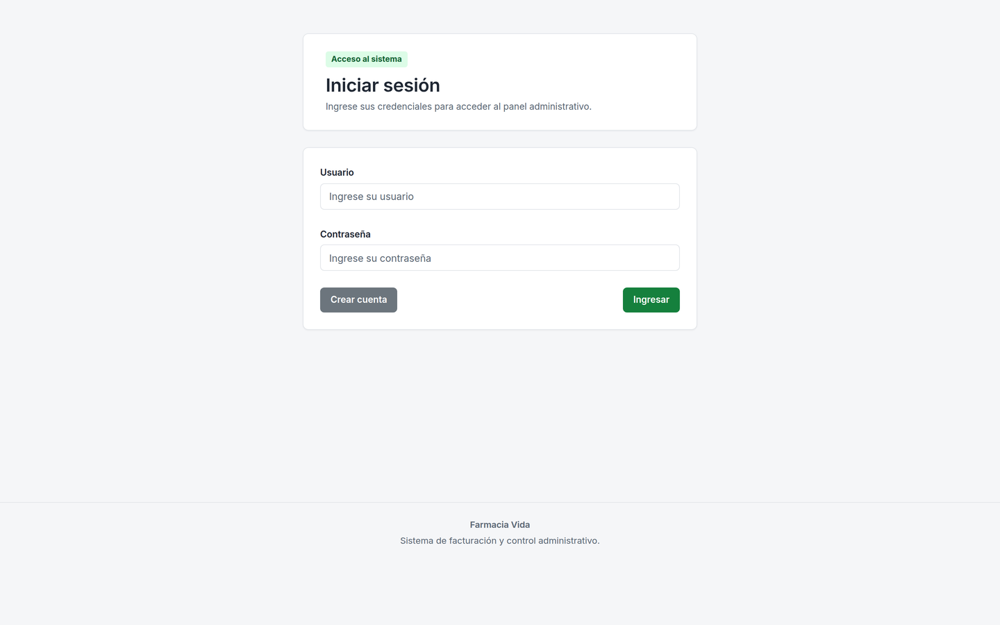
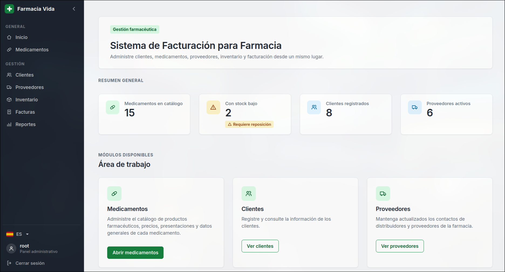
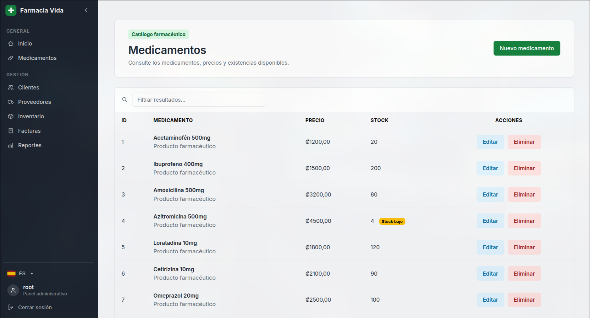
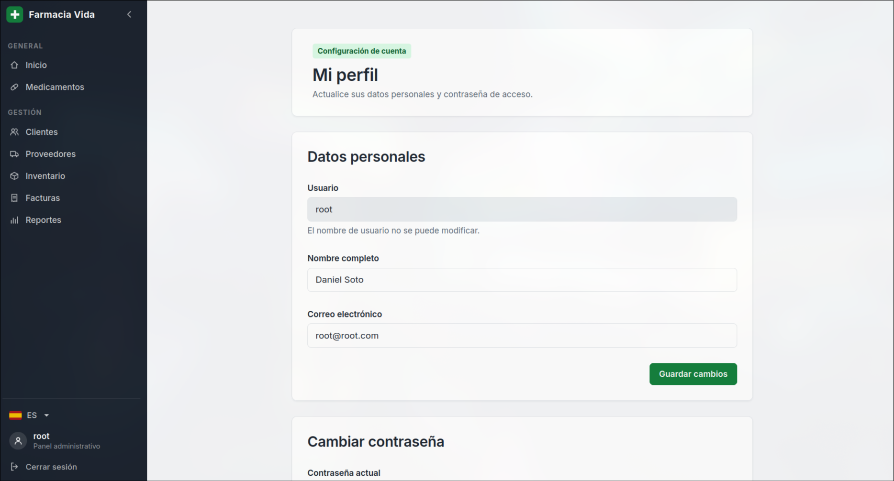
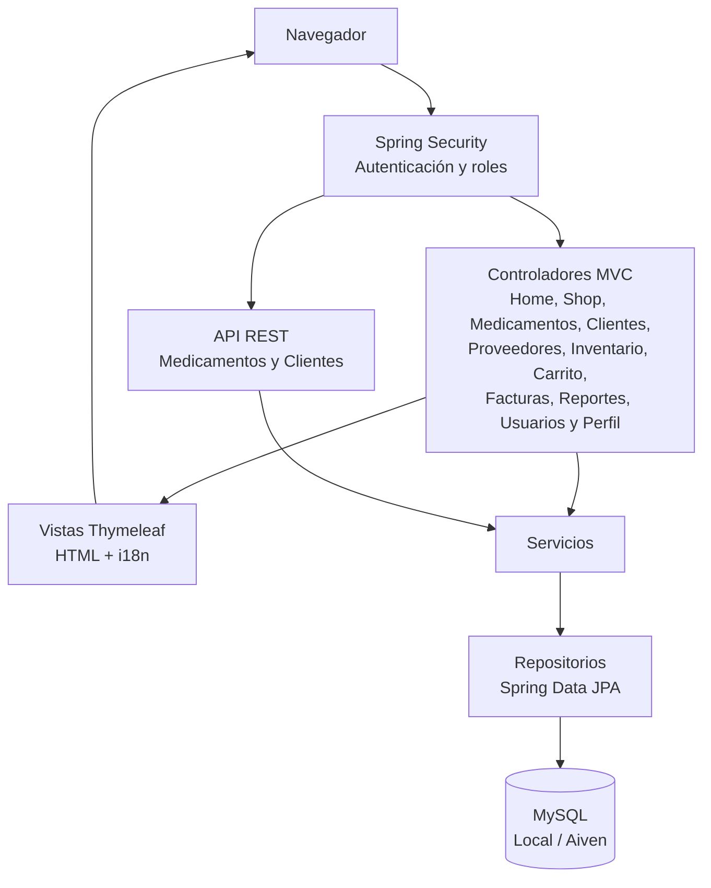

<p align="center">
  
</p>

<h1 align="center">Farmacia Vida</h1>

<p align="center">
  Sistema web de gestión, inventario, ventas y facturación para una farmacia, construido con Spring Boot y Thymeleaf.
</p>

<p align="center">
  
  
  
  
  
  
  
  
</p>

## Contenido

1. [Descripción](#descripción)
2. [Aplicación publicada](#aplicación-publicada)
3. [Características](#características)
4. [Capturas](#capturas)
5. [Arquitectura](#arquitectura)
6. [Stack tecnológico](#stack-tecnológico)
7. [Modelo de datos](#modelo-de-datos)
8. [API REST](#api-rest)
9. [Seguridad y roles](#seguridad-y-roles)
10. [Internacionalización](#internacionalización)
11. [Requisitos e instalación local](#requisitos-e-instalación-local)
12. [Despliegue](#despliegue)
13. [Acceso inicial](#acceso-inicial)
14. [Estructura del proyecto](#estructura-del-proyecto)
15. [Equipo](#equipo)

## Descripción

Farmacia Vida es una aplicación web desarrollada para centralizar las principales operaciones de una farmacia. El sistema integra el catálogo de medicamentos, control de inventario, clientes, proveedores, usuarios, carrito de compras, ventas, facturación y reportes dentro de una misma aplicación.

El acceso se controla mediante tres roles: **ADMIN**, **EMPLEADO** y **CLIENTE**. Cada usuario dispone únicamente de las opciones correspondientes a sus funciones.

El sistema permite además realizar compras simuladas mediante efectivo o SINPE, generar facturas, actualizar automáticamente las existencias después de una venta y consultar estadísticas y reportes.

El proyecto corresponde al curso **SC-403 Desarrollo de Aplicaciones Web y Patrones** de la Universidad Fidélitas.

## Aplicación publicada

La versión de producción se encuentra disponible en:

**https://farmacia-vida.onrender.com**

La aplicación está desplegada mediante **Docker en Render** y utiliza una instancia **MySQL administrada por Aiven**.

> Debido al uso de una instancia gratuita de Render, la primera solicitud puede tardar mientras el servicio vuelve a iniciar después de un período de inactividad.

## Características

| Módulo | Descripción | Acceso |
|--------|-------------|--------|
| Dashboard | Indicadores de medicamentos, stock bajo, clientes y proveedores. | ADMIN, EMPLEADO |
| Tienda | Catálogo visual con buscador, productos destacados, imágenes, stock y detalle de medicamentos. | Público |
| Medicamentos | Registro, edición, eliminación, stock, precios, imágenes, proveedor y productos destacados. | ADMIN |
| Clientes | Registro, consulta y búsqueda de clientes. | ADMIN, EMPLEADO |
| Proveedores | Administración de proveedores relacionados con medicamentos. | ADMIN, EMPLEADO |
| Inventario | Consulta de existencias, precios y alertas de stock bajo. | ADMIN, EMPLEADO |
| Carrito | Selección de productos y cantidades para preparar una compra o venta. | ADMIN, EMPLEADO, CLIENTE |
| Facturación | Checkout, selección de cliente, cálculo de totales, métodos de pago, generación e impresión de factura. | ADMIN, EMPLEADO, CLIENTE |
| Historial de facturas | Consulta de ventas y detalle de las facturas generadas. | Según rol |
| Reportes | Ventas por fecha, total vendido y medicamentos más vendidos en un rango de fechas. | ADMIN |
| Usuarios | Administración de usuarios y roles. | ADMIN |
| Mi perfil | Actualización de nombre, correo y contraseña del usuario autenticado. | Usuarios autenticados |
| API REST | Endpoints REST para medicamentos y clientes con autenticación y autorización. | Según rol |

Además:

* El stock se descuenta automáticamente al confirmar una venta.
* El sistema controla situaciones de stock insuficiente.
* Los medicamentos con pocas existencias se identifican visualmente.
* Las facturas almacenan el detalle de los productos vendidos.
* El administrador dispone de reportes por fechas.
* Los productos pueden mostrar imágenes almacenadas dentro de la aplicación.
* La interfaz está disponible en español e inglés.
* La barra lateral adapta las opciones según el rol autenticado.
* Se incluyen páginas personalizadas para errores 404, 5xx y acceso denegado.
* El diseño es responsivo mediante Bootstrap 5 y estilos propios.

## Capturas

<table>
  <tr>
    <td width="50%"></td>
    <td width="50%"></td>
  </tr>
  <tr>
    <td width="50%"></td>
    <td width="50%"></td>
  </tr>
</table>

## Arquitectura

La aplicación sigue una arquitectura por capas sobre Spring Boot. Las solicitudes web son procesadas por controladores MVC o controladores REST. La lógica de negocio se concentra en servicios y el acceso a los datos se realiza mediante repositorios de Spring Data JPA.

Spring Security se encarga de la autenticación y autorización antes de permitir el acceso a las diferentes funcionalidades.



El flujo principal sigue la separación:

```text
Vista
  ↓
Controller
  ↓
Service
  ↓
Repository
  ↓
MySQL
```

## Stack tecnológico

* Java 25.
* Spring Boot 4.1.
* Spring Web MVC.
* Thymeleaf.
* Spring Security.
* Spring Data JPA.
* Hibernate.
* Bean Validation.
* MySQL 8.
* Bootstrap 5.
* HTML, CSS y JavaScript.
* Maven mediante Maven Wrapper.
* Docker para el empaquetado de producción.
* Render para el alojamiento de la aplicación.
* Aiven para MySQL en producción.
* Postman para pruebas de la API REST.
* Git y GitHub para control de versiones.

## Modelo de datos

Las principales entidades del sistema son:

| Entidad | Información principal | Función |
|---------|----------------------|---------|
| Usuario | username, nombre, correo, password, rol | Autenticación y autorización |
| Medicamento | nombre, descripción, precio, stock, imagen, destacado, proveedor | Catálogo e inventario |
| Cliente | identificación, nombre, teléfono, correo | Información de compradores |
| Proveedor | nombre, teléfono, correo | Distribuidores de medicamentos |
| CarritoItem | usuario, medicamento, cantidad | Persistencia del carrito |
| Venta | fecha, comprador, totales, método de pago, estado | Facturación |
| DetalleVenta | venta, medicamento, cantidad, precio, subtotal | Productos incluidos en una venta |
| Empleado | información asociada al personal | Información del personal |

Las contraseñas de los usuarios se almacenan cifradas mediante BCrypt.

Hibernate genera y actualiza las tablas a partir de las entidades JPA configuradas en el proyecto.

## API REST

El proyecto contiene controladores REST para medicamentos y clientes.

La ruta principal de medicamentos es:

```text
/api/medicamentos
```

### Medicamentos

| Método | Ruta | Descripción |
|--------|------|-------------|
| GET | `/api/medicamentos` | Lista los medicamentos |
| GET | `/api/medicamentos/{id}` | Consulta un medicamento |
| POST | `/api/medicamentos` | Registra un medicamento |
| PUT | `/api/medicamentos/{id}` | Actualiza un medicamento |
| DELETE | `/api/medicamentos/{id}` | Elimina un medicamento |

Las operaciones fueron verificadas mediante Postman, incluyendo respuestas `200 OK` y `204 No Content` para una eliminación exitosa.

Ejemplo de cuerpo JSON utilizado para registrar un medicamento:

```json
{
  "nombre": "Medicamento API Prueba",
  "descripcion": "Medicamento creado desde Postman para prueba de la API",
  "precio": 2500,
  "stock": 10,
  "imagenUrl": "",
  "destacado": false
}
```

### Clientes

La aplicación también dispone de endpoints REST para la consulta de clientes bajo las reglas de seguridad configuradas.

En `docs/postman_collection.json` se incluye una colección para realizar pruebas de la API.

Ejemplo de consulta:

```bash
curl -u admin:TU_CONTRASENA http://localhost:8080/api/medicamentos
```

## Seguridad y roles

Spring Security controla las rutas y funcionalidades disponibles.

### ADMIN

El administrador puede acceder a las funciones administrativas, entre ellas:

* Gestión de medicamentos.
* Gestión de clientes.
* Gestión de proveedores.
* Inventario.
* Facturación.
* Usuarios y roles.
* Reportes y estadísticas.
* API REST administrativa.

### EMPLEADO

El empleado participa en las operaciones diarias de la farmacia:

* Consulta de tienda.
* Gestión y consulta de clientes.
* Consulta de inventario.
* Carrito.
* Venta presencial.
* Facturación e historial correspondiente.

### CLIENTE

El cliente puede utilizar el flujo de compra:

* Consultar la tienda.
* Agregar medicamentos al carrito.
* Confirmar una compra.
* Consultar sus facturas.
* Administrar su perfil.

Además:

* Las contraseñas se cifran mediante BCrypt.
* El registro público crea cuentas con rol CLIENTE.
* Los formularios utilizan protección CSRF.
* La API utiliza autenticación HTTP Basic y reglas de autorización.
* Las rutas administrativas están protegidas según el rol.
* Se dispone de una página personalizada para acceso denegado.
* Los errores del servidor no muestran stack traces al usuario final.

## Internacionalización

La aplicación dispone de soporte para español e inglés.

La configuración utiliza un `CookieLocaleResolver`, por lo que la preferencia seleccionada se conserva mediante una cookie.

El idioma también puede modificarse utilizando:

```text
?lang=es
```

o:

```text
?lang=en
```

Los mensajes se encuentran distribuidos en:

```text
messages.properties
messages_es.properties
messages_en.properties
```

## Requisitos e instalación local

Requisitos:

* JDK 25 o superior.
* MySQL 8.
* Git.
* No es necesario instalar Maven por separado, ya que el proyecto incluye Maven Wrapper.

### 1. Crear la base de datos

```sql
CREATE DATABASE farmaciadb;
```

### 2. Configurar credenciales

En PowerShell:

```powershell
$env:DB_USERNAME="root"
$env:DB_PASSWORD="SU_CONTRASEÑA"
```

### 3. Ejecutar las pruebas

```powershell
.\mvnw clean test
```

El proyecto debe finalizar con:

```text
BUILD SUCCESS
```

### 4. Ejecutar la aplicación

```powershell
.\mvnw spring-boot:run
```

La aplicación local estará disponible normalmente en:

```text
http://localhost:8080
```

En una base vacía, `DataSeeder` carga información inicial para facilitar las pruebas del sistema.

## Despliegue

La versión final utiliza la siguiente arquitectura:

```text
GitHub
   ↓
Render
   ↓
Docker / Spring Boot
   ↓
Aiven MySQL
```

### Render

Render construye la aplicación utilizando el `Dockerfile` incluido en el repositorio.

El perfil activo en producción es:

```text
prod
```

La aplicación publicada está disponible en:

**https://farmacia-vida.onrender.com**

### Aiven

La base de datos de producción utiliza MySQL administrado por Aiven con conexión SSL.

Las credenciales de producción no se almacenan directamente en GitHub.

Las principales variables de entorno utilizadas son:

```text
SPRING_PROFILES_ACTIVE
DB_URL
DB_USERNAME
DB_PASSWORD
```

`application-prod.properties` obtiene la configuración de conexión desde estas variables.

## Acceso inicial

Al iniciar el sistema sobre una base de datos vacía, `DataSeeder` crea información de prueba, incluyendo las cuentas iniciales de administrador y empleado.

Por seguridad, las credenciales utilizadas para una demostración o ambiente de producción deben mantenerse fuera de la documentación pública y modificarse cuando sea necesario.

## Estructura del proyecto

```text
src/main/java/com/ufide/Farmacia
├── config
│   ├── DataSeeder
│   └── LocaleConfig
├── controller
│   ├── api
│   ├── AuthController
│   ├── CarritoController
│   ├── ClienteController
│   ├── FacturaController
│   ├── HomeController
│   ├── InventarioController
│   ├── MedicamentoController
│   ├── PerfilController
│   ├── ProveedorController
│   ├── ReporteController
│   ├── ShopController
│   └── UsuarioController
├── dto
├── entity
├── repository
├── security
├── service
└── util

src/main/resources
├── static
│   ├── css
│   ├── img
│   │   └── productos
│   └── js
├── templates
│   ├── carrito
│   ├── clientes
│   ├── error
│   ├── factura
│   ├── fragments
│   ├── inventario
│   ├── medicamentos
│   ├── perfil
│   ├── proveedores
│   ├── reportes
│   ├── shop
│   └── usuarios
├── application.properties
├── application-prod.properties
├── messages.properties
├── messages_es.properties
└── messages_en.properties
```

## Equipo

| Integrante | Módulos a cargo |
|------------|-----------------|
| Andros Rodríguez Santana | Por asignar |
| Carlos Soto Solórzano | Por asignar |
| Alejandro Salas Sánchez | Por asignar |
| Ismael Morun Cascante | Por asignar |

Proyecto académico desarrollado para la **Universidad Fidélitas**.