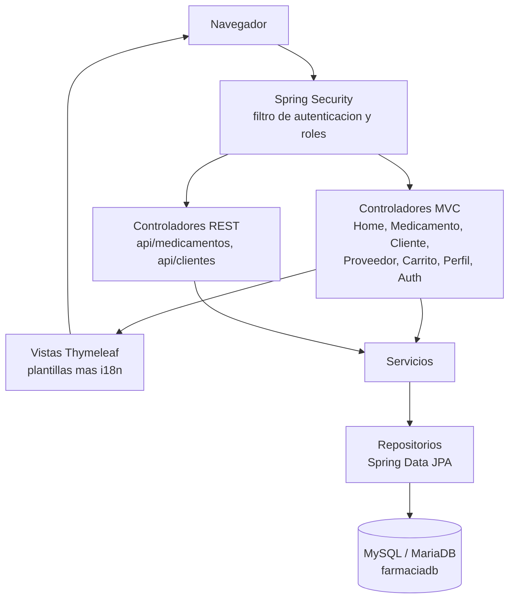

<p align="center">
  
</p>

<h1 align="center">Farmacia Vida</h1>

<p align="center">
  Sistema web de gestión y facturación para una farmacia, construido con Spring Boot y Thymeleaf.
</p>

<p align="center">
  
  
  
  
  
  
  
</p>

## Contenido

1. [Descripción y cliente](#descripción-y-cliente)
2. [Características](#características)
3. [Capturas](#capturas)
4. [Arquitectura](#arquitectura)
5. [Stack tecnológico](#stack-tecnológico)
6. [Modelo de datos](#modelo-de-datos)
7. [API REST](#api-rest)
8. [Seguridad](#seguridad)
9. [Internacionalización](#internacionalización)
10. [Requisitos e instalación local](#requisitos-e-instalación-local)
11. [Despliegue](#despliegue)
12. [Credenciales de prueba](#credenciales-de-prueba)
13. [Estructura del proyecto](#estructura-del-proyecto)
14. [Equipo](#equipo)

## Descripción y cliente

Farmacia Vida es una aplicación web pensada para el personal de una farmacia. El cliente necesita llevar en un solo lugar el catálogo de medicamentos con sus precios y existencias, la información de sus clientes y la de sus proveedores, además de un carrito para preparar pedidos. El acceso se controla por roles: el administrador gestiona toda la información, mientras que el empleado consulta el catálogo.

El sistema atiende tres necesidades del negocio:

* Centralizar el inventario de medicamentos y avisar cuando una existencia queda baja.
* Mantener ordenados los datos de clientes y proveedores, hoy dispersos en hojas de cálculo.
* Separar lo que cada tipo de usuario puede ver y hacer, para proteger la información sensible.

Es el proyecto final del curso SC-403, Desarrollo de Aplicaciones Web y Patrones, de la Universidad Fidélitas.

## Características

| Módulo | Descripción | Acceso |
|--------|-------------|--------|
| Medicamentos | Alta, edición, borrado y listado con buscador interno. Marca las existencias bajas. | Administrador |
| Consulta de medicamentos | Vista del catálogo para el personal de ventas. | Empleado |
| Clientes | Registro y consulta de clientes con buscador interno. | Administrador |
| Proveedores | Gestión de distribuidoras y contactos con buscador interno. | Administrador |
| Carrito | Armado de pedidos a partir del catálogo. | Empleado |
| Mi perfil | Edición de nombre y correo, y cambio de contraseña del propio usuario. | Todos |
| API REST | Endpoints de medicamentos y clientes con autenticación básica. | Según rol |

Además:

* Tablero de inicio con indicadores en vivo (total de medicamentos, existencias bajas, clientes y proveedores).
* Interfaz en español e inglés, conmutable desde la barra lateral.
* Barra lateral colapsable que recuerda su estado entre páginas.
* Diseño responsivo con contrastes verificados para accesibilidad.

## Capturas

<table>
  <tr>
    <td width="50%"></td>
    <td width="50%"></td>
  </tr>
  <tr>
    <td width="50%"></td>
    <td width="50%"></td>
  </tr>
</table>

## Arquitectura

La aplicación sigue una arquitectura por capas sobre Spring Boot. El navegador habla con dos familias de controladores: las vistas MVC con Thymeleaf y la API REST. Ambos delegan la lógica en los servicios, que a su vez usan repositorios de Spring Data JPA para llegar a la base de datos. Spring Security envuelve todo el flujo con un filtro que aplica autenticación y control de acceso por rol.



## Stack tecnológico

* Java 25 y Spring Boot 4.1.
* Spring Web MVC y Thymeleaf para las vistas del servidor.
* Spring Security 7.1 para autenticación por formulario, autenticación básica en la API y control de acceso por rol.
* Spring Data JPA con Hibernate para la persistencia.
* MySQL 8 en producción, compatible con MariaDB en desarrollo.
* Bean Validation para validar formularios y cuerpos de la API.
* Bootstrap 5 para la retícula y los componentes base, con una hoja de estilos propia.
* Maven como herramienta de construcción, mediante el wrapper incluido.

## Modelo de datos

Entidades principales que usan los módulos operativos:

| Entidad | Campos | Notas |
|---------|--------|-------|
| Usuario | username, nombre, correo, password, rol | Contraseña cifrada con BCrypt. Rol ADMIN o USER. |
| Medicamento | nombre, precio, stock | El precio se maneja en colones. |
| Cliente | nombre, teléfono, correo | |
| Proveedor | nombre, teléfono, correo | Teléfono de ocho dígitos. |

El esquema incluye además las tablas ventas, detalle_venta y empleados, reservadas para la fase de facturación. Las tablas se generan con Hibernate a partir de las entidades.

## API REST

La API usa autenticación básica. Las lecturas de medicamentos están disponibles para ambos roles; el resto de operaciones y todo lo relativo a clientes queda restringido al administrador.

| Método | Ruta | Descripción | Acceso |
|--------|------|-------------|--------|
| GET | /api/medicamentos | Lista de medicamentos | Administrador, Empleado |
| GET | /api/medicamentos/{id} | Detalle de un medicamento | Administrador, Empleado |
| POST | /api/medicamentos | Crea un medicamento | Administrador |
| PUT | /api/medicamentos/{id} | Actualiza un medicamento | Administrador |
| DELETE | /api/medicamentos/{id} | Elimina un medicamento | Administrador |
| GET | /api/clientes | Lista de clientes | Administrador |
| GET | /api/clientes/{id} | Detalle de un cliente | Administrador |

En `docs/postman_collection.json` está la colección de Postman lista para importar. Configure el usuario y la contraseña en las variables de la colección antes de ejecutar las peticiones.

Ejemplo de lectura con autenticación básica:

```bash
curl -u admin:TU_CONTRASENA http://localhost:8080/api/medicamentos
```

## Seguridad

* Inicio de sesión por formulario para las vistas y autenticación básica para la API.
* Control de acceso por rol. Las rutas de administración (clientes, proveedores y la escritura en la API) exigen rol ADMIN; el catálogo de medicamentos está disponible para ambos roles.
* Contraseñas cifradas con BCrypt. El registro público solo puede crear usuarios con rol USER.
* Protección CSRF activa en todos los formularios. La API queda exenta por usar autenticación básica sin estado.
* La página de perfil opera siempre sobre el usuario de la sesión; el cambio de contraseña exige la contraseña actual.
* Los mensajes de error no exponen trazas internas.

## Internacionalización

La interfaz está disponible en español e inglés. El idioma se resuelve por una cookie y se puede cambiar en cualquier momento con el selector de la barra lateral o agregando `?lang=en` o `?lang=es` a la dirección. Los textos, los mensajes de validación y las notificaciones viven en `messages_es.properties` y `messages.properties`.

## Requisitos e instalación local

Requisitos previos:

* JDK 25 o superior.
* MySQL 8 o MariaDB en ejecución.
* No hace falta instalar Maven: se usa el wrapper `./mvnw`.

Pasos:

1. Cree la base de datos:

   ```sql
   CREATE DATABASE farmaciadb;
   ```

2. Exporte las credenciales de la base de datos (ajuste según su instalación):

   ```bash
   export DB_USERNAME=root
   export DB_PASSWORD=su_contraseña
   ```

3. Arranque la aplicación:

   ```bash
   ./mvnw spring-boot:run
   ```

4. Abra `http://localhost:8080` en el navegador.

En el primer arranque, con la base vacía, se cargan datos de prueba de forma automática (medicamentos, clientes, proveedores y usuarios).

Nota para usuarios de MariaDB: si Hibernate no detecta el dialecto, agregue el argumento `--spring.jpa.properties.hibernate.dialect=org.hibernate.dialect.MariaDBDialect` al arranque.

## Despliegue

La guía completa para publicar el sistema en internet está en `docs/DEPLOY.md`. Incluye el `Dockerfile`, el perfil de producción y los pasos para desplegar en Railway con una base de datos gestionada.

## Acceso inicial

En el primer arranque, con la base vacía, se crean dos usuarios: uno administrador (`admin`) y uno empleado (`empleado`).

Las contraseñas no se guardan en el repositorio. Se definen con las variables de entorno `SEED_ADMIN_PASSWORD` y `SEED_EMPLEADO_PASSWORD`. Si no se definen, la aplicación genera una contraseña temporal para cada usuario y la escribe en el log de arranque; búsquela ahí para iniciar sesión y cámbiela desde la página de perfil.

```bash
export SEED_ADMIN_PASSWORD=una_contraseña_fuerte
export SEED_EMPLEADO_PASSWORD=otra_contraseña_fuerte
```

## Estructura del proyecto

```
src/main/java/com/ufide/Farmacia
├── config          Carga de datos de prueba y configuración de idioma
├── controller      Controladores MVC
│   └── api         Controladores REST
├── dto             Objetos de formulario y transferencia
├── entity          Entidades JPA
├── repository      Repositorios de Spring Data
├── security        Configuración de Spring Security
└── service         Lógica de negocio
src/main/resources
├── static          Hoja de estilos, scripts e ícono
├── templates       Plantillas Thymeleaf y fragmentos
├── messages_es.properties
└── messages.properties
```

## Equipo

| Integrante | Módulos a cargo |
|------------|-----------------|
| Andros Rodríguez Santana | Por asignar |
| Carlos Soto Solórzano | Por asignar |
| Alejandro Salas Sánchez | Por asignar |
| Ismael Morun Cascante | Por asignar |

Proyecto académico desarrollado para la Universidad Fidélitas.
